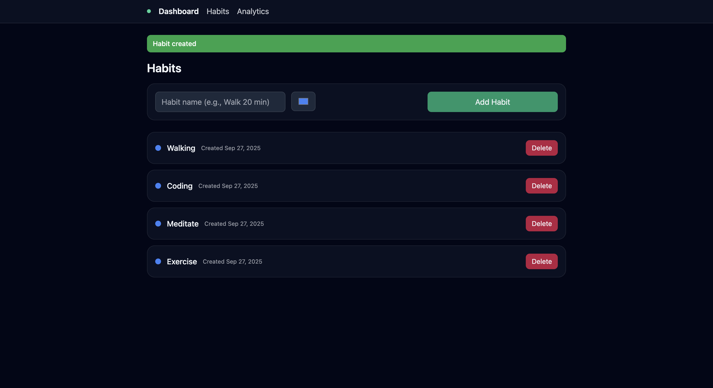
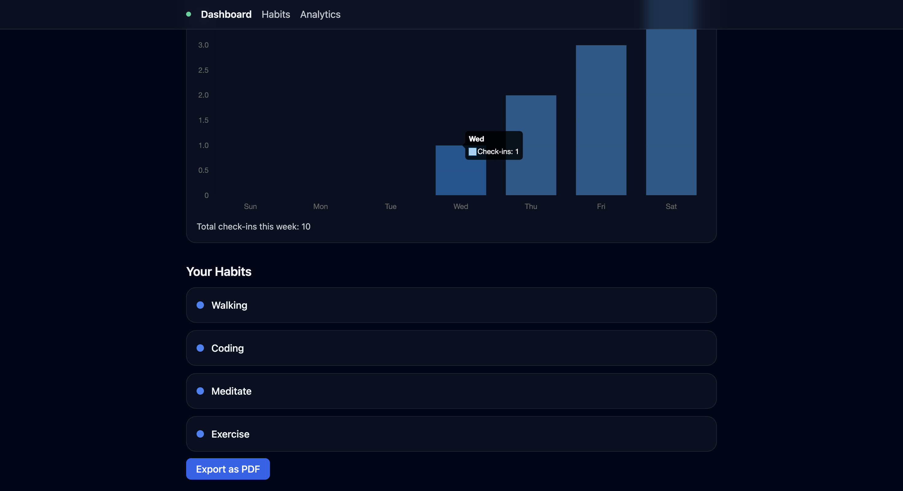

# Habit Hero 🏆

Habit Hero is a **personal habit tracker** built with **Flask**, **SQLite**, and **Tailwind CSS**. It helps you create habits, track daily check-ins, visualize weekly progress, and even export reports as PDF.

---

## Features

- ✅ Create habits with a name and color.
- 📅 Track daily check-ins for each habit.
- 🔥 View current streaks and weekly check-ins.
- 📊 Analytics page with a bar chart showing check-ins over the past 7 days.
- 📄 Export weekly habit progress as a PDF report.
- 🎨 Clean and responsive UI with Tailwind CSS.

---

## Screenshots

**Dashboard:**  


**Habits Page:**  


**Analytics Page:**  


---

## Tech Stack

- **Backend:** Python, Flask, SQLAlchemy
- **Database:** SQLite
- **Frontend:** HTML, Tailwind CSS, Chart.js
- **PDF Export:** ReportLab

---

## How to Use

1. Open the project in your Python environment.
2. Install dependencies:

```bash
pip install flask flask_sqlalchemy reportlab
